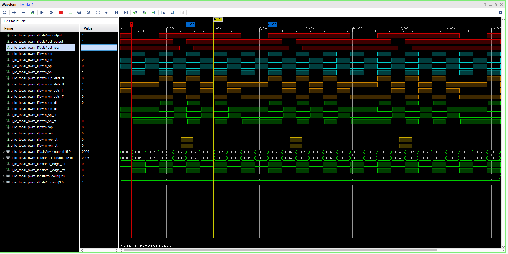
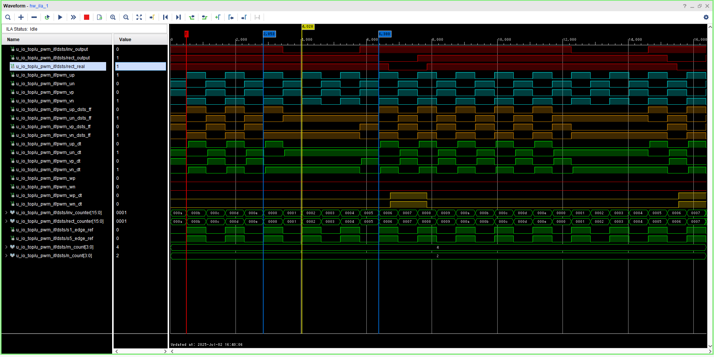
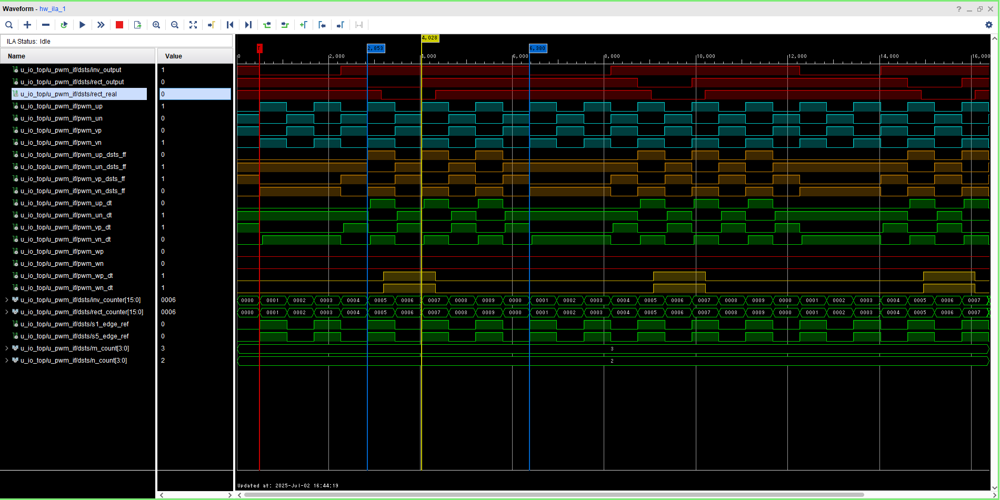

# DSTSPDM_FF
Dual-Side Transient Shaping Pulse Density Modulation の制御信号をFF的に入れるためのコード

## 重要な変数
- PDMの周期Tpdm（半周期 * TPDM）
  - 例：30周期中半周期スキップ → TPDM=60
- 1次側パルススキップ数m
- 2次側パルススキップ数n
- パルス遅延時間td（半周期基準）
  - 例：一次側に対して2次側が3.5 + 1/4周期遅れ → td=7

## 動作波形（ロジックアナライザ）

  
  

  

<strong>m=2,n=1,Tpdm=8,td=3での動作波形</strong>

  
  

  

<strong>m=4,n=2,Tpdm=15,td=5での動作波形</strong>

  
  

  

<strong>m=3,n=2,Tpdm=10,td=4での動作波形</strong>

